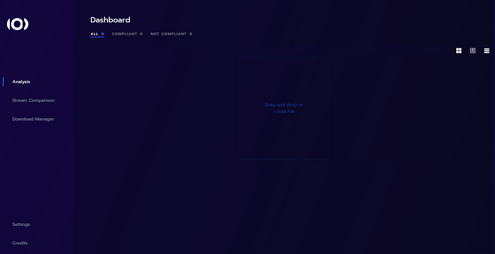
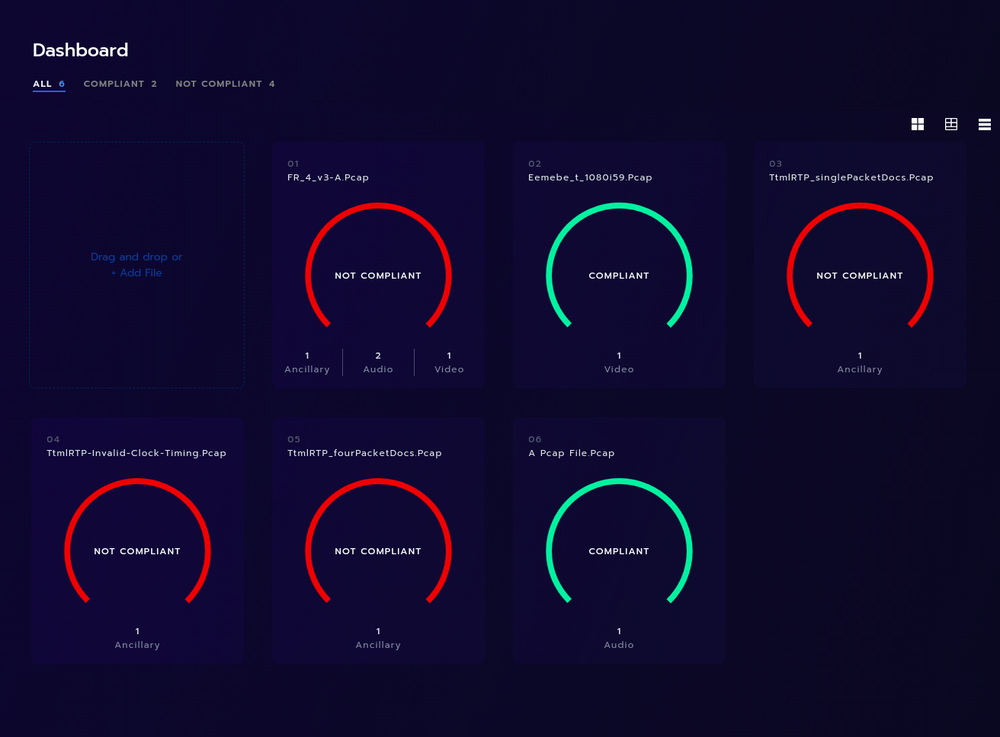
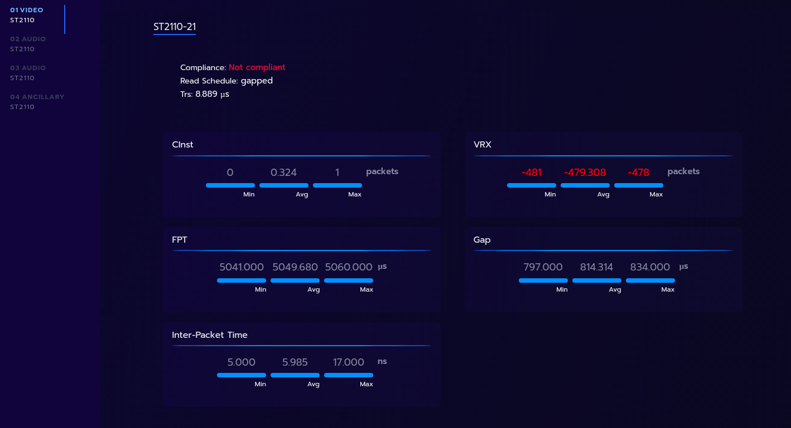
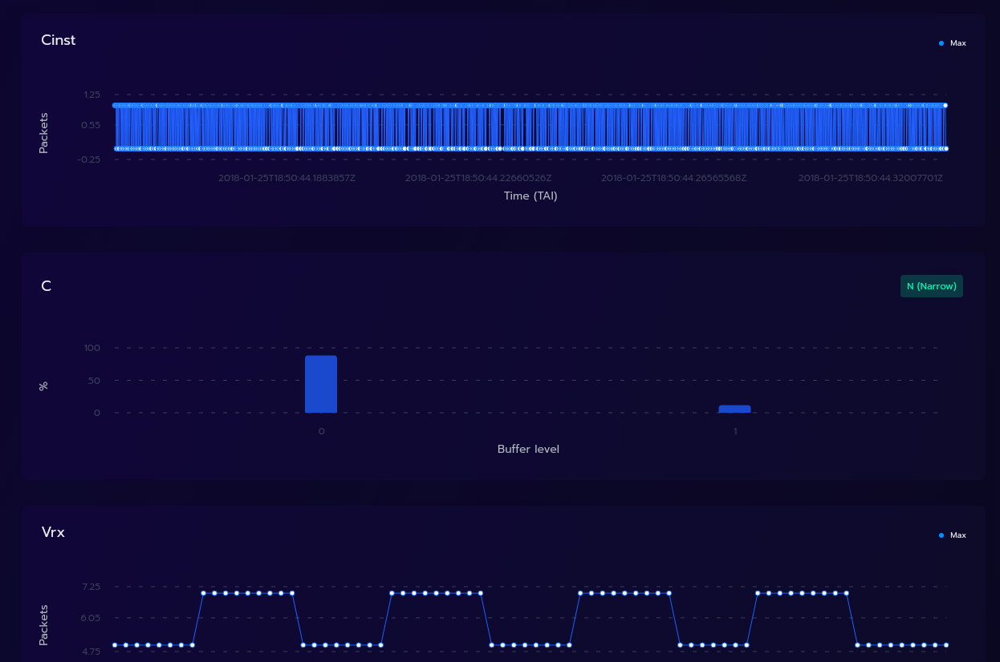

# Project Status

**Important Notice:** This is a fork of a [project](https://github.com/ebu/pi-list) that was started by the European Broadcasting Union (EBU) in 2017, but is no longer actively maintained by them.

Please consider, that the original license is transferred to the fork. This means, no warranty or liability is provided.

The original notice warns to be aware of the following:
- **Ageing Codebase:** The project may rely on outdated dependencies or practices no longer considered best-in-class.
- **Potential Security Risks:** Due to the lack of ongoing updates, security vulnerabilities could exist or arise over time.
- **Use at Your Own Risk:** We recommend reviewing the code and dependencies carefully before using it in production environments.

Although the aim is to fix some of the issues mentioned above, it will not happen immediately. This message may or may not be removed at a later stage.

# Live IP Software Toolkit to assist EBU members in the implementation of IP based facilities

LIST is composed by:

-   a set of libraries that handle the ST2110 standards suite;
-   a browser-based application that analyzes previously captured network packets as pcap files.

## Main Features

|                                                        |                                |
| :----------------------------------------------------- | :----------------------------: |
| Quickly see if your streams are compliant with ST2110. |     |
| See each individual stream                             |   |
| Drill drown on each stream and understand the details  |  |

## Your own instance of LIST

-   [How to run your instance of LIST](./docs/how-to-install-on-local-docker.md)

## For developers

-   [How to compile LIST](./docs/compiling_guide.md)
-   [How to further develop LIST](./docs/development_guide.md)
-   [Perform validation tests](./docs/validation_tests.md)
-   [Create Read only user](./docs/read_only_user.md)
-   [API documentation](./docs/api.md)

## Additional information

-   [Video timing analysis](./docs/video_timing_analysis.md)
-   [Audio timing analysis](./docs/audio_timing_analysis.md)
-   [Ancillary data](./docs/ancillary_data.md)
-   [Stream compare](./docs/stream_compare.md)
-   [TTML](./docs/ttml.md)

## License

See [LICENSE](LICENSE.md) for more information.

## Note from the fork author

I forked the original repository to work on it in my free time. This forked repository is not connected to any of my employers in any way.
