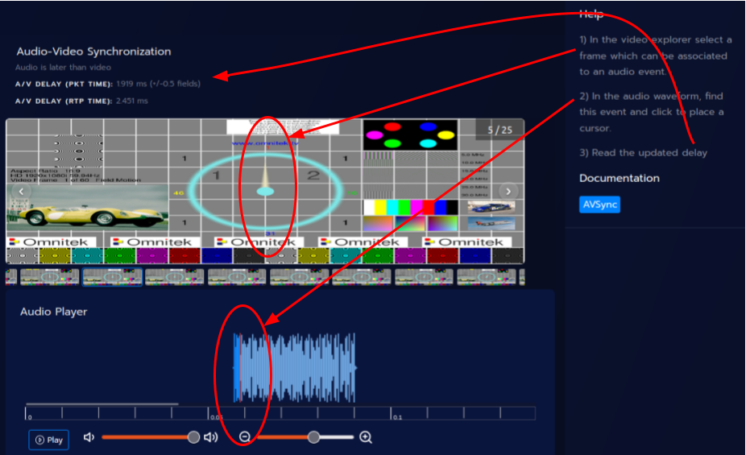

# Audio-Video Synchronization

## Concept

The proposed method allows to quantify the audio-to-video alignement
manually by giving the user the ability to vizualize the decoded frames
and audio waveform side by side and place *time makers* on it. The delay
is computed in both network domain (packet capture timestamps) and media
domain (RTP timestamps).

## Instructions

* Setup a test pattern generator in physical space or in the network.
  The media should consist of identifiable video events synced with
  audio events like a clap or a dedicated pattern.
* Capture both audio and video simultaneously and analyze in LIST
* In `Compare streams` page:
    - select the capture file
    - select either video or audio a `reference`
    - select the other one as `main`
    - name the analysis, exple `AV something`
    - press `Compare`

* Then interpret the results

| Results | Description |
|---|---|
| *AV Delay (capture time)* | This is diff between *audio time marker* and *video time marker*. Precision of +/-0.5 field/frame is due the unability to accuratly date natural a event captured by a camera sensor. |
| *AV Delay (RTP time)* | Same but calculated from *RTP time markers* |

## Under the hood

* On frame selection, the *video capture time marker* corresponds to the capture timestamp
  of 1st the packet of the frame/field. This works perfectly for a
  pattern generator, but not 100% accurate for natural feed.
* On audio cursor moved, the *audio capture time marker* is computed from the
  the new cursor position on the waveform (relative time) offset by the
  capture timestamps of the 1st packet of audio stream.
* For both audio and video, *RTP time marker* = *capture time marker* - *pkt_time_vs_rtp_time*
  (from influxDB).

